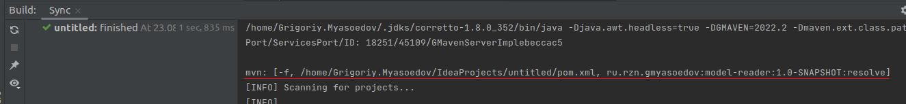

GMaven
==================

The lightweight Maven plugin that gets the project model through maven task execution.
This provides greater simplicity and original build tool behavior in obtaining project data.

### IntelliJ Plugin - https://plugins.jetbrains.com/plugin/22370-gmaven
### Plugin home page - https://github.com/grisha9/gmaven-plugin

### Maven Plugin for IntelliJ IDEA

The plugin adds support for the Maven for Java language projects:
 - Import project structure to IDE
 - Original Maven behavior for getting project model
 - Execution Maven tasks 
 - Support separate modules for production and test roots

### Prerequisites

1. IntelliJ IDEA 2022.2 or higher
2. JDK 11
3. Maven 3.3.1+  or higher

### General information

- For open existing project structure - select GMaven plugin on the dialog box after selecting the project
- For creating new project select GMaven on build system tab on New Project Wizard

- If you found a bug, please report it on https://github.com/grisha9/gmaven-plugin/issues

### Setup

- For manual build run the command: gradlew clean build
- And then get distribution from: gmaven-plugin/gmaven/build/distributions

### Issues
If you found a bug, please report it on https://github.com/grisha9/gmaven-plugin/issues

If your problem is related to importing a project model or executing a maven task,
then please compare the behavior of the plugin with the original behavior of Maven.
To do this, take the following output from the logs (Build or Run IDEA window),
for example: "mvn: [-f, /home/test-profiles/pom.xml, compile"
And run from command line: mvn -f /home/test-profiles/pom.xml compile
If the behavior of the plugin and Maven are the same, then the problem is not with the plugin.

